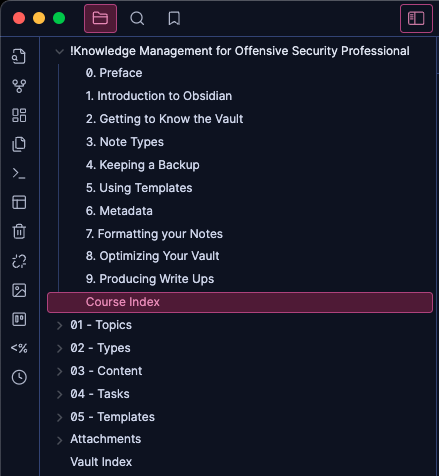

# Knowledge Management Systems for Offensive Security Professionals

Welcome to the **Knowledge Management Systems for Offensive Security Professionals** course! This course is designed to provide you with efficient knowledge management methodologies tailored for ethical hacking. 

> **Note**: The principles and strategies shared here will also benefit anyone pursuing a college degree or preparing for any certification.

---

## Course Overview

This course focuses on:
- **Knowledge management systems and methodologies** for organizing, managing, and optimizing notes.
- Practical applications of **Obsidian**, an S-tier note-taking application.

---

## Getting Started

### Prerequisites
- Install [**Obsidian**](https://obsidian.md/) (free note-taking application).
- Clone this repository 
- Download this repository's zip.

### Setup Instructions
1. **Copy the `TemplateVault` Folder**:
   - After downloading this repository, extract the zip file.
    
   - Locate the `TemplateVault` folder.
   - Copy it to your desired location (e.g., `Documents`).

2. **Open the Vault in Obsidian**:
   - Launch Obsidian.
   
   - Use the "Open Folder as Vault" option to select the `TemplateVault` folder.
   

---

## Course Contents

### In the Vault
The main content is in the folder `!Knowledge Management for Offensive Security Professionals` within the vault. 

This folder includes the course's contents, explaining how the vault is configured and how you can replicate or customize the setup.
- **Lessons 1-9**:
  1. **Vault Folder Structure**
  2. **Using Predetermined Markdown Notes**
  3. **Keeping Backups for Free**
  4. **Using Note Templates**
  5. **Adding Metadata to Notes**
  6. **Maintaining Proper Formatting**
  7. **Optimizing the Vault (Housekeeping)**
  8. **Organizing for Efficient Access**
  9. **Producing Penetration Testing Backups**

### PDF Lessons
For users who prefer not to use the course within Obsidian, this repository includes a `PDF Lessons` directory outside of the vault. This directory contains all course content, rendered in PDF format for easy reference.

---

## Key Features of the TemplateVault
- **Custom Folder Structure**: Designed to suit the needs of offensive security professionals.
- **Predetermined Templates**: Simplify and speed up note-taking.
- **Metadata Management**: Make your notes more searchable and organized.
- **Backup Strategies**: Learn how to back up your notes for free.
- **Optimization Tips**: Keep your vault clean and efficient.

---

## Why Use This Course?
- **Efficiency**: Save time by leveraging a preconfigured system.
- **Flexibility**: Learn knowledge management methodologies that apply to ethical hacking and other challenging disciplines.
- **Customization**: Understand how to adapt the system to your needs.

---

## Contributing
Contributions are welcome! If you have suggestions for improving the course, feel free to open an issue or submit a pull request.

---

## Support
If you encounter any issues or have questions, please contact Rafael at rafael@todosec.com.

---

# Credits

Special thanks to [TrustedSec for sharing their Obsidian setup](https://www.trustedsec.com/blog/obsidian-taming-a-collective-consciousness).

---

# To-Do

- [x] Add AV false positives disclaimer.
- [x] Solve AV false positives problem.
- [x] New "how to use this course" Readme.md.
- [ ] YT videos.
